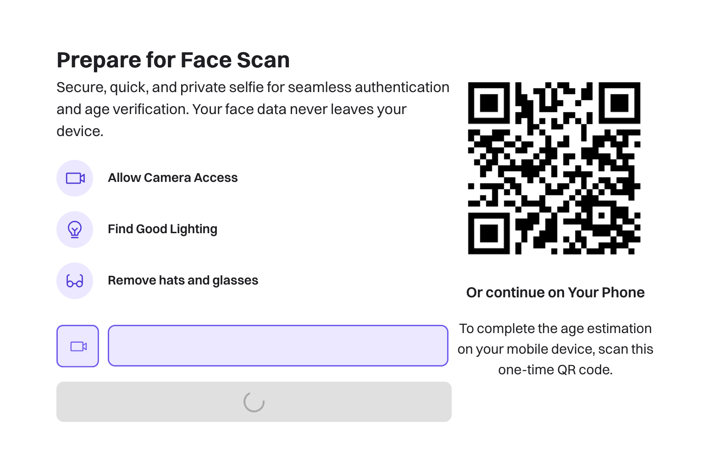
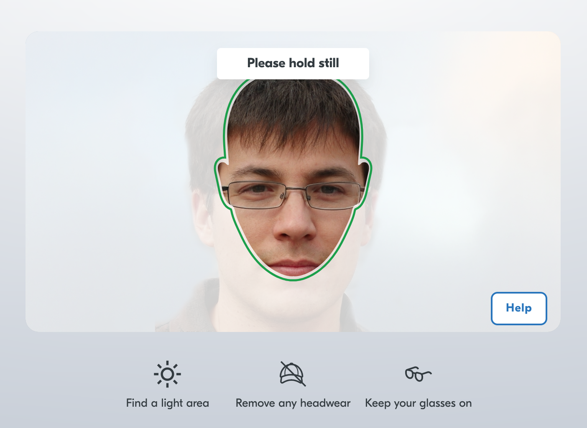

If you're in the UK^[Many US states are doing similar things now. The European Union has plans for a similar approach. You won't be able to escape this for long.], you will soon be presented with a difficult choice:

You will be asked to either:

1. Stop using an online service you enjoy; or
2. Provide [sensitive information to a stranger on the Internet](https://tvtropes.org/pmwiki/pmwiki.php/WebVideo/AtomicShrimp). 

The stranger might be called something cute like *"Yoti"*. They'll have a flashy website and they'll make all kinds of promises about using encryption and deleting your sensitive information afterwards. They might be based in a [country with poor data protection laws](https://en.wikipedia.org/wiki/United_States). They might have a 10,000 word terms of service document that says they can process your data however they like.

That's life on the Internet in the UK right now.

## Why Is This Happening?

This is happening because the [UK government requires it](https://www.legislation.gov.uk/ukpga/2023/50).

The UK *Online Safety Act (2023)* requires sites with content deemed *harmful to children*^[This definition includes, but is nowhere near limited to, pornography.] to require [*highly-effective age assurance*](https://www.ofcom.org.uk/online-safety/protecting-children/age-checks-to-protect-children-online). This basically means something like a facial scan with liveness^[The system must be certain that the face being presented isn't just an image of an adult face - it must pass certain "liveness" checks.] detection, a credit card check, or an identity document check.

This affects online services *globally*. The OSA gives the UK communications regulator - [Ofcom](https://www.ofcom.org.uk/) - the power to act against services that don't comply *even if* they aren't hosted in the UK. If a service has a *significant number* (what that means, exactly, is a matter of debate) of UK users, it must comply. The penalties (gleefully called "enforcement action" by Ofcom) are financial and potentially custodial. If they can't financially ruin or imprison service operators, Ofcom can also engage with UK ISPs to block sites that don't comply.^[Fedizen [Neil Brown](https://mastodon.neilzone.co.uk/@neil) has an excellent resource if you want to learn more about the OSA without reading the hundreds of pages of legisation - [onlinesafetyact.co.uk](https://onlinesafetyact.co.uk/)]

## Why This Sucks

⚠️ This section contains **Folf Opinions**. {.note}

Firstly, from a political viewpoint - it's **lazy, incompetent government**. It's treating a symptom not a cause. It's society shrugging shoulders and saying _"well, fixing this is too hard, time to outsource it to some profiteering techbros"_. The government have handed this highly-sensitive, risk-fraught problem off to an unregulated, profit-hungry global marketplace.

Secondly, from a technical viewpoint - it's a **scam**. "Privacy-preserving age verification" does not exist. There is **no way** to reliably confirm the age of a user without collecting some identifiable information from them. Any proposed system will either violate the privacy of users unacceptably, or be ineffective.  Entirely-client side solutions implicitly trust the client and are subject to bypass attacks or spoofing attacks.

Many services have chosen to simply [close down](https://onlinesafetyact.co.uk/in_memoriam/) rather than walk this tightrope. Small indie producers of adult media are often already struggling financially and will be simply unable to deal with the cost or complexity of age verification solutions. This also makes the OSA a form of censorship with the financial burden associated with age verification used as a weapon against media the government looks down upon.

Many users won't *want* to make the choice I described at the start of this post. They'll find other options. They'll use dodgy VPNs. They'll use sites that ignore the law anyway. This will do what any prohibition does - it'll drive users and providers underground into greater danger.

These concerns, among many others, were raised to MPs on multiple occasions during the consultation stages and later to Ofcom during the numerous Q&A sessions they ran. They were constantly hand-waved away.

This has all the makings of a privacy nightmare waiting to happen. This what happens when the [grossly uninformed and incompetent](https://www.parliament.uk/) dictate complex technical policy.

## My AV Experience So Far

Since these services are about to become an unavoidable part of online life for UK netizens, I thought I'd take a look at a couple of them in terms of their effectiveness and how well (or poorly) they protect the privacy of users.

### k-ID

Discord uses [k-ID](https://www.k-id.com/). Behind the scenes, k-ID appears to use another product, [Privately](https://www.privately.eu/). I found some [developer documentation](https://documentation.privately.eu/articles/faceassure-browser-gettingstarted) on the solution too.

The choices for verification are a face scan, which they insist will not be uploaded to their servers, and an ID verification using a third-party that specialises in document-based identity verification. I didn't try the ID verification route.

The face scan involves a [frontend app](https://d3ogqhtsivkon3.cloudfront.net/) that uses some WebAssembly components to perform some computer vision analysis on a live webcam image. During the test, you can be asked to perform a few actions like opening your mouth or looking left or right. This is part of the _"liveness testing"_ to validate that you're not just showing a static picture of a face or wearing a mask. These are the possible prompts that you can be given during the verification:

```
STAY_STILL,
LOOK_STRAIGHT,
TURN_LEFT,
TURN_RIGHT,
SLIGHTLY_TILT_YOUR_HEAD_LEFT,
SLIGHTLY_TILT_YOUR_HEAD_RIGHT,
OPEN_YOUR_MOUTH,
KEEP_YOUR_MOUTH_OPEN,
CLOSE_YOUR_MOUTH,
```

I was able to spoof k-ID with some AI-generated images based on a royalty-free stock photo and a virtual webcam stream. The system makes some attempt to detect and reject what they refer to as "screen attacks" - holding up a display or paper with a static image on it. The frontend also attempts to detect virtual webcam devices.

I did some analysis of the frontend application for privacy concerns and found a few items of note. When starting a new verification, you receive a UUID (which the documentation calls the transaction ID). After each attempt at verification, some data is `POST`ed to the Privately API that contains a few interesting things:

- Your transaction ID
- Your device details, including:
	- Browser name and version, connection speed and whether your device is classed as a mobile
	- A list of the camera devices on your system, names, their IDs, resolutions, framerates, and other imaging properties
	- OS version & architecture
- The result of the prediction (success, or one of the possible failure modes)
- Which liveness test instructions you completed/failed and associated timestamps
- Timelines of the expressions on your face (I.e. positions of ~16 tracking points on your face with associated timestamps)
- The prediction of your age, if successful

These are compiled into your transaction record and stored by Privately. I found an API endpoint within the application that appeared to allow querying of these based on transaction ID, so they clearly persist for some time after your verification process. I was still able to retrieve my transaction record at time of writing, a good 3 days after my verification. 

That said, they did not at any time appear to upload actual image data.

### Go.cam

I'm going to go easy on [Go.cam](https://go.cam/) because it's the only even-vaguely [open source](https://github.com/Godotcam/goCamOpenSource) solution as far as I can tell. Supposedly. you can roll this solution out for free on your own site if you want, but I'm not sure how easy/difficult they make that.

I only looked at the facial scanning option, but there is also an identity document scan option and a credit card option (which requires hand-off to a third party payment processor).

I found that I could quite easily spoof Go.cam with static images, either using a virtual webcam device or simply held up in front of a real camera. There's some basic liveness testing which involves asking you to smile/relax but that wasn't a really challenge. There's a public demo for Go.cam which you can [try yourself](https://go.cam/demo/?).

 <video controls>
  <source src="{{ './gocam-spoof.mp4' | url }}" type="video/mp4">
  Your browser does not support the video tag.
</video> 

That said, as far as I can tell there is no data uploaded to a backend other than the age output by the client-side TensorFlow model, so from a privacy standpoint this solution is one of the better ones.

### KWS & Yoti

[Bluesky](https://bsky.app/) are using [KWS](https://www.kidswebservices.com/en-US) & [Yoti](https://www.yoti.com/) for age verification. 

I'm not really a Bluesky user, but I do have an account and couldn't help but take a look when I got the email telling me that [some features would be restricted if I didn't verify](https://bsky.social/about/blog/07-10-2025-age-assurance).

KWS is Epic Game's foray into the Age Assurance market. Yoti seems to be the technology behind the face scanning aspect of KWS. I didn't try the identity card/document scanning option.

Privacy-wise, it's among the very worst. 



Yoti is unashamedly a server-side solution. Your image is straight-up `POST`ed to their backend after some framing and pre-processing in the frontend app. They [pinky-swear](https://www.yoti.com/privacy/age-verification/) that they delete everything after verification, but who knows. There's no independent validation of this. They could be storing images forever, training models on them, selling them, who knows. They could be dumped into a public S3 bucket with a prefix that reveals what site you're verifying against for all you know.



The [frontend](https://verification.kidswebservices.com/en/verification) is also very complex and makes use of obfuscated JavaScript which made proper analysis of it quite difficult. They do appear to do some sort of encryption^[I found mentions of this in the frontend sources. The best way to dig into this is to configure your developer tools to break on XHR so you can view the stack upto the point where the image data is POSTed to the backend.] of the image data prior to `POST`ing it, but the obfuscation of their app made it difficult to work out what exactly was happening.

Flagrantly violating user privacy by analysing images server-side does allow them to run a much more complex model though. Most of the images I submitted were rejected with a nondescript `Failed to process image` error. Other attempts failed with a `Spoofing attempt detected` error. I haven't given up on finding a solution that works. Like most systems, there's a maximum number of attempts before they boot you out with a semi-permanent failure, but Bluesky seems to allow you to make a new verification attempt as many times as you want.

I've still got more work to do on Yoti but I'll update the post if/when I make some progress.

## What Can I Do?

What indeed can one do?

[Write to your MP](https://www.writetothem.com/). Express upon them how this approach is putting UK users specifically at risk of identity theft, extortion and surveillance. Tell them how the OSA is making it more difficult for UK users to run businesses and is directly hurting the economy. Tell them why this isn't solving the core issues of safety online, and encourage them to pivot their approach to better education schemes for both adults & kids.

There's also an [ePetition](https://petition.parliament.uk/petitions/722903) active at the moment - I don't reserve much hope for these things since they are mostly just ignored by Parliament, but if you're a UK citizen, you may want to sign it too.
