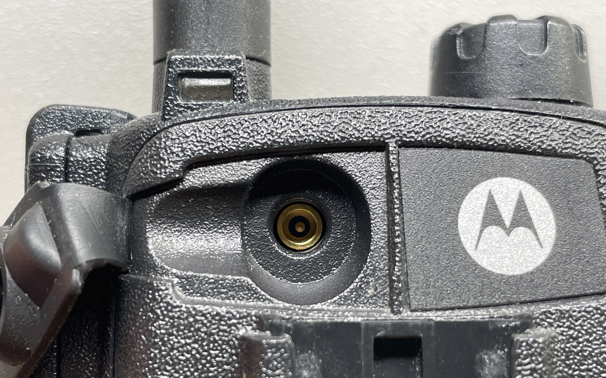
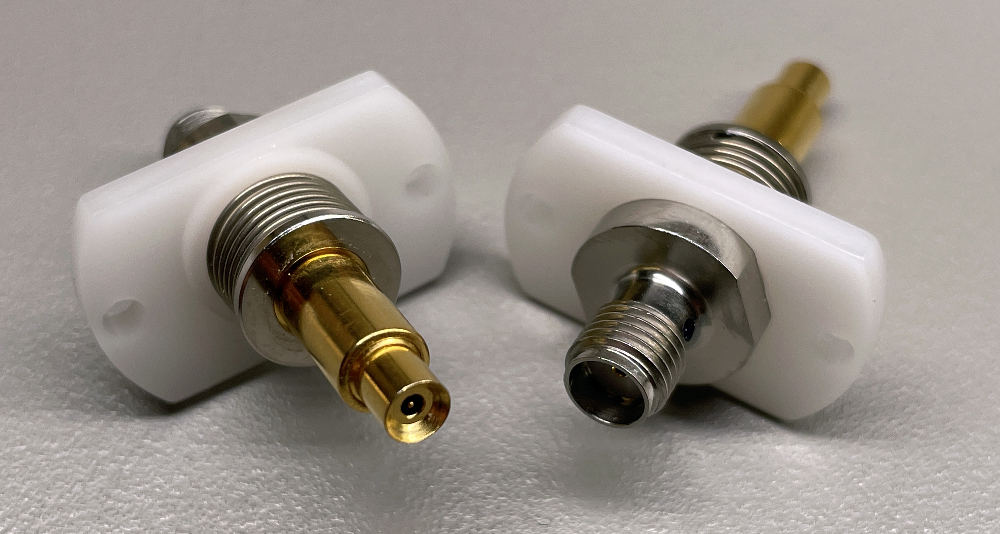
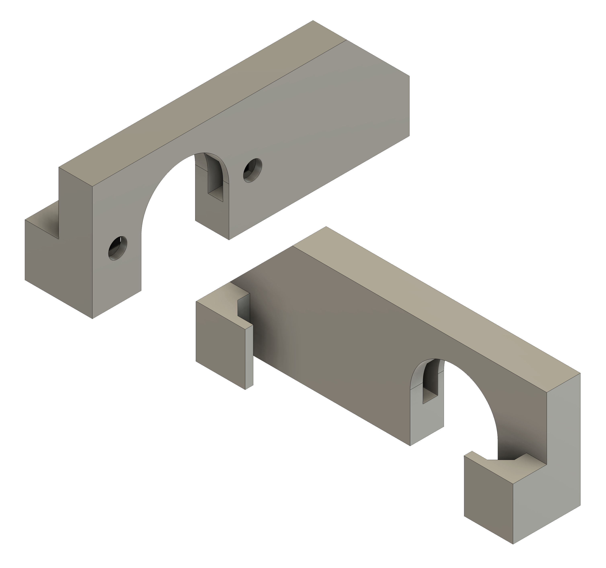
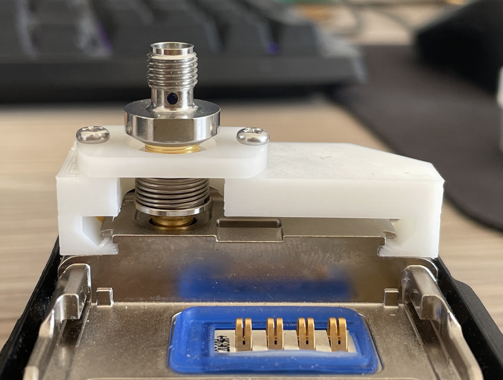

This is just a short post about a little adapter I designed for the [Motorola MTP3000](https://www.motorolasolutions.com/en_xp/products/tetra/devices/mtp3250.html) series of TETRA radios. The adapter allows you to connect to the antenna port on the rear of the radio for testing or other situations where you don't want the fixed whip antenna fitted. Motorola often calls this the "VA" (*Vehicular Adapter*) port in their service manuals since it's often used for "car kit" type situations where you want to use an external vehicle-mounted antenna.

A tricky aspect of many (but not all^[MTP8550 appears to use an SMA-style antenna connection, as do the newer MXP600 radios]) Motorola TETRA portables is that their antennas only have a single metallic element/connection. The chassis/body of the radio (and your hand!) form the other antenna element. This is all fine until you need to connect the radio to some equipment, or an external antenna via a coaxial cable.

The VA port is actually an _RF Switch Connector_.^[These are available from a few manufacturers, but [MuRata](https://www.murata.com/products/connector/switchconnector) seems to be one of the most popular brands.] When mated, the main antenna is disconnected and the mated accessory is connected. When the mated accessory is removed from the VA port, the main antenna is reconnected.

## Making Connections

Finding something to connect to these ports proved quite tricky. Typically, these connectors are used for production testing of RF circuitry. A jig with a probe will mate with the connector on a PCBA and probe or inject some RF signal to check the product is performing correctly. Because they tend to only be used in these sorts of factory environments, there isn't much of an economy of scale going on, so the probes are *annoyingly* expensive. I did pick up a few cheap Motorola car kits on eBay but results were mixed, and the connectors on these were not often usable as standalone components (often involved springs and features moulded into the specific car kit that would not survive disassembly).

Eventually I found a few MuRata probes - `MM126037` - on [eBay](https://www.ebay.co.uk/itm/165429039928) for ~£10 each. These are quite nice as they present an SMA connector on the back. At time of writing, the seller still has quite a few left. Worryingly these run at around £100 [retail](https://octopart.com/mm126037-murata-7122993).

## Designing

There isn't too much to say about the design process for something like this. Nobody seemed to have made an accurate model of an MTP3000 radio, so it was just a matter of lots of caliper measurement &rarr; alter design &rarr; print &rarr; test &rarr; swear &rarr; repeat.

I tried to make the design as quick to print as possible mainly to speed up my development cycle. Now that the dimensions are correct it could probably be made more sturdy at the expense of a slightly longer print. The two slots on the inside of the "arch" accommodate M2.5 nuts (which can be glued in place to make them captive if you wish). The adapter clips onto the rails on the back of the radio that normally accommodate a thin plastic cover. The MM126037 probe can then be attached with M2.5 machine screws.

## The Result

It works, but it's a bit fragile.

One slight annoyance is that to remove and install the adapter you need to undo the M2.5 machine screws and remove the MuRata probe first. I might change the design at some point to use clips rather than machine screws.

## Files

Here's the STL for the model if you fancy printing one yourself: 

I'd recommend printing with 100% infill. PLA/PETG can be used. The model is best printed standing upright with the port cutout forming an "arch" with the printer bed.
