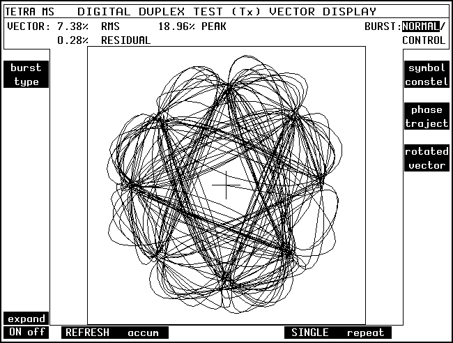

[TETRA](https://www.etsi.org/technologies/tetra) is an [ETSI](https://www.etsi.org/) standard that defines a suite of radio communication tools geared towards public-safety (police, fire, emergency medical, etc) and large-scale users (airports, construction projects, public events, etc). It's *"walkie-talkies, but for serious stuff"*.

The standard provides great flexibility for system designers. A wide range of system topologies are possible, including hybrid systems containing both point-to-point and infrastructure elements via repeaters and gateways. Fast call-setup and a powerful precedence and prioritisation system built-in to the radio protocol make the standard particularly appealing to critical communication users.

I first came across TETRA at University while studying Digital Mobile Communications. Later, as I got into SDR, digital radio and DSP, I returned to TETRA to refresh my understanding of it. I guess you could say it's been a bit of a vehicle for learning more about digital radio in general.

In this series of posts, I'll be writing about TETRA V+D (Voice + Data), which is probably what most people mean when they say "TETRA". It's the cellular trunked radio communication standard defined in [EN 300 392](https://www.etsi.org/deliver/etsi_en/300300_300399/30039201/01.06.01_60/en_30039201v010601p.pdf). There are other systems in the TETRA suite of tools, including DMO (Direct Mode) defined in [EN 300 396](https://www.etsi.org/deliver/etsi_en/300300_300399/30039601/01.02.01_60/en_30039601v010201p.pdf) which are also interesting, but I won't discuss them here. 

I might find it a little difficult to write about in a way that is actually coherent without skimming over a *lot* of detail, so apologies in advance for that. TETRA is very flexible in terms of implementation options, which makes describing it succinctly rather difficult, but I will do my best and cover the most "normal" cases here.

This post covers the radio/physical layer and some parts of the lower TETRA MAC. In future posts, I'll aim to cover more of the protocol stack.

## The TETRA Signal

In TETRA V+D, Mobile Stations (MS) communicate with Base Stations (BS) over a frequency-duplex air interface. Typically, MSs transmit on the *uplink* 10MHz below^[This is called duplex spacing, and is configurable, as well as being reversible such that the MS transmits above the BS frequency instead.] the *downlink* frequency on which they are receiving messages from the BS. A BS may transmit multiple carriers to provide increased control & traffic capacity.

TETRA is specified to work over a wide range of frequencies. The lowest 100MHz-wide band defined by the protocol is 300MHz and the highest is 900MHz[^1]. As far as I'm aware, most European TETRA networks operate in the 380-430MHz band.

[^1]: See [ETSI TS 100 392-15 TETRA frequency bands, duplex spacing and channel numbering](https://www.etsi.org/deliver/etsi_ts/100300_100399/10039215/01.05.01_60/ts_10039215v010501p.pdf) for more information

The RF power output of TETRA transmitters is defined according to a class-based system. MS transmitters range from Class 4L at 0.56W to Class 1 at 30W. Today, most hand-portable TETRA MSs are either Class 4 (1W) or Class 3L (1.8W). BS transmitters range from Class 10 at 0.6W to Class 1 at 40W per carrier.

The transmitted signal is 18,000 symbols/second^[The symbol period is formally defined as 500/9&micro;S] &pi;/4 DQPSK^[&pi;/4 Differential Quadrature Phase Shift Keying (https://en.wikipedia.org/wiki/Phase-shift_keying), though in more recent specifications of the air interface, other modulation schemes (QAM) are supported.] with an RRC^[Root-Raised Cosine] filter with &alpha;=0.35. 

{class="invert-dark"}

The filter ensures that the transmitted signal is 25kHz wide and has very low co-channel interference, meaning many TETRA carriers can be crammed into a fairly small piece of spectrum. The trade-off to this is that the signal is variable-envelope, meaning highly linear amplification is required. This made early TETRA mobiles quite expensive, but also made the technology appealing to users wishing to fit a digital system over an existing 25kHz channel plan.

Each &pi;/4 DQPSK symbol conveys two bits of information, therefore the signal has a net bit rate of 36,000 bits/second. With time-division multiple access, error control schemes, training sequences and guard periods, the gross bit throughput of a channel is significantly lower.

## The Shared Physical Medium

The physical layer of TETRA is based around a TDMA^[Time Division Multiple Access, a resource-sharing scheme where different devices take slices of time to use the shared transmission medium. https://en.wikipedia.org/wiki/Time-division_multiple_access] frame structure. The most important structure is the *frame*, which contains 4 *timeslots* (*slots*). Frames are arranged into two higher-level structures, *multiframes* (18 frames) and *hyperframes* (60 multiframes)^[Hyperframes exist primarily for the purposes of providing a slow-moving counter for synchronisation of encryption key changes, etc. They are not often referred to by the general operation of the protocol].

Timeslots on the uplink are also subdivided into two *subslots*, which serve multiple purposes that I'll expand upon later.



A physical channel is identified by a timeslot number (1 to 4) and a pair of frequencies (uplink and downlink). The repeating structure of TDMA frames means that each frequency pair can support up to 4 bidirectional physical channels. At any time, each physical channel is designated as either Control, Traffic or Unallocated.

The final (18th) frame of each multiframe is designated as the Control Frame, which is reserved for control information regardless of the use of that timeslot number in other frames 1-17.

BSs transmit in every downlink slot. If there is no information to transmit, null (zero) MAC messages fill any unused slots. The first timeslot on the main carrier transmitted by a BS contains the *Main Control Channel*, to which MSs listen to by default while idle. MSs transmit either when explicitly assigned capacity by the BS, or using a random-access procedure based on [slotted ALOHA](https://en.wikipedia.org/wiki/ALOHAnet#Slotted_ALOHA). The random-access procedures are complex, so I may discuss these in a separate post.

The TDMA structure is synchronised between BS and MSs, but there is an offset such that the uplink slot 1 takes place one slot-time after the downlink slot 1 finishes. 



This allows for bidirectional communication to take place without the requirement for an MS to be able to receive and transmit on the uplink and downlink simultaneously. The intermediate slot also provides time for an MS to switch between transmitting and receiving in this scenario (if required^[Some MSs, called \"fast-switching\" MSs, are able to transmit and receive on adjacent slots, though this capability is not a requirement]). Consequently, TETRA supports full-duplex ("phone call") style calls.



Some measure of delay is imposed by the discontinuous arrival of data as a result of the "bursty" delivery of data in each frame, and also as a result of the reservation of frame 18 for control use.

### RF Bursts

During each timeslot, a *burst* (a period of modulated RF carrier) may be transmitted. Each transmitted burst conveys some information, and also contains some important sequences used by the physical layer to synchronise receivers and protect against timing errors introduced by path delay.

Note that the diagrams included in this section are not to scale, and omit some elements. See [EN 300 392-2 Section 9.9.4](https://www.etsi.org/deliver/etsi_en/300300_300399/30039202/03.08.01_60/en_30039202v030801p.pdf) for the full picture.

#### Downlink Bursts

On the downlink, three main types of burst are defined^[Other types of burst exist to support specialised discontinuous carrier time-sharing modes that are out of scope here]. 



The *Normal Downlink Burst* is the normal mechanism by which control information and traffic are transmitted on the downlink. It carries two blocks of 216 bits, separated by a training sequence and the "Broadcast Block" which contains 30 bits.



The *Synchronisation Burst* is a specialised burst containing information to allow receiving MSs to obtain timing synchronisation with the BS. It carries a block of 120 bits of synchronisation data, alongside a block of 216 usable bits. The 30-bit "Broadcast Block" is also present. The Synchronisation Burst contains a "frequency correction" field, which is a sequence that when modulated and filtered produces a tone 2.25kHz above the carrier frequency, preceded and followed by a tone 6.75kHz below the carrier frequency. These sequences allow MSs to accurately synchronise to the BS carrier frequency. 

The third type of downlink burst is the *Linearisation Uplink Burst* which doesn't carry any usable data.

#### Uplink Bursts

On the uplink, three types of burst are available. 



The *Normal Uplink Burst* is the normal mechanism by which data is transmitted on the uplink once an MS has assigned capacity to transmit. It takes up a full slot and carries two blocks of 168 usable bits. 



The *Control Uplink Burst* is a shorter burst, carrying a single block of 168 usable bits and fitting inside a single subslot. This type of burst is used for initial random access attempts by MSs transmitting unsolicited messages. The ability for this type of burst to be transmitted in either subslot effectively doubles the number of random access opportunities available. I'll talk about random access more later. 

The third type of uplink burst is the *Linearisation Uplink Burst* which doesn't carry any usable data.

### Linearisation Bursts

A quick note about those linearisation bursts - the Uplink and Downlink Linearisation Bursts provide opportunities for transmitters to go on-air and linearise their power amplifiers before transmitting meaningful data. Remember I mentioned earlier on that the TETRA signal requires linear amplification? In many implementations, that is based on some sort of feedback loop that requires operating the amplifier on-air. Linearisation bursts are transmitted during allocated opportunities when required.

## Next Time

In the next post in this series, I'll be writing about TETRA MAC *Logical Channels*, which is really where things start to get interesting from a network protocol perspective.
